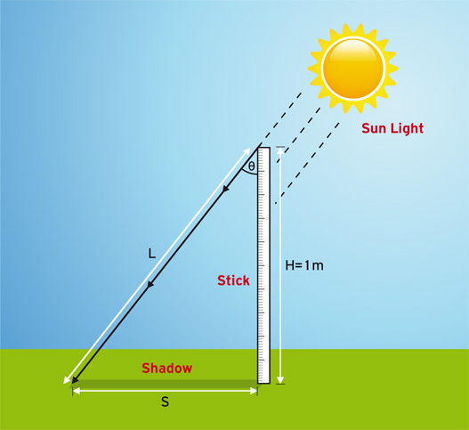

**Example Gnomon:** Take a one-meter stick (H= 1 meter, see figure
below) and place it vertically to the ground. Measure the length of the
stick to make sure it is one meter long. At the time scheduled to
conduct the experiment, and measure the length of the stick’s shadow
(length S in the figure below). Repeat the measurement 5 times and write
their values down.

Gnomon Example

## How could this experiment be done very simply at home using common materials such as a cereal box, a pencil and bluetac? 

## What is the value of taking the measurements a number of times? 

## Reference

https://eratosthenes.ea.gr/content/experiment
