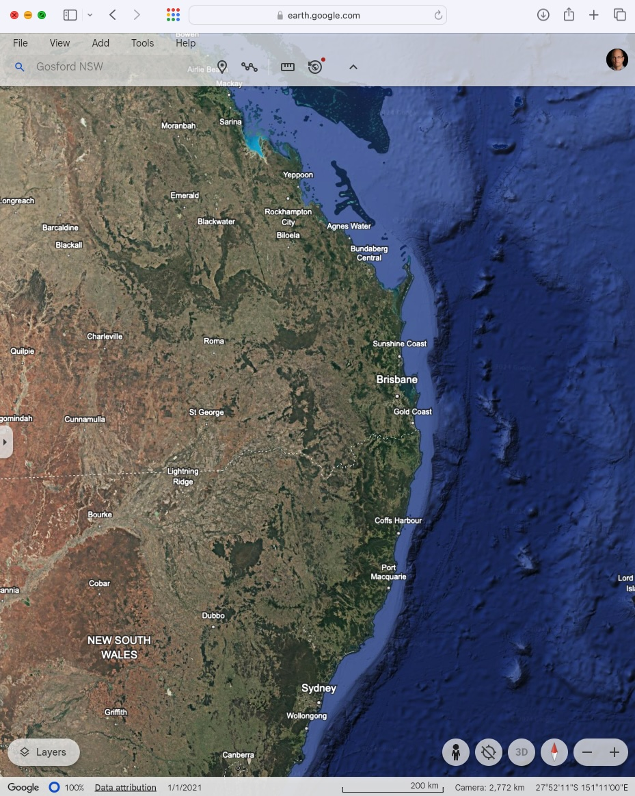

Eratosthenes measured the angle of the Sun in Alexandria on the Summer
solstice and knew the distance to Syene (modern-day Aswan) which was on
the Tropic of Cancer. Both cities fell on approximately the same
longitude. In our replication, the angle of the Sun on will be measured
on mid-day of the Australian Summer solstice - December 21.

One Australian city will be Gosford. The task is to create a method to
find a location that serves as the equivalent to Syene with latitude on
the Tropic of Capricorn (23.5° South). The following is an example
method.

## **Method: Measurement Using Google Earth**

**Step 1**: Using \[[Google Earth](https://earth.google.com/)\] bring
the East Coast of Australia. You can see the Latitude / longitude on the
bottom right of the screen (see Figure 1 below).

**Step 2**: Ensuring the image is kept north, by moving your mouse
approximately up from Gosford, find an Australia city that falls on the
Tropic of Capricorn. Record the name of the city.

City: \_\_\_\_\_\_\_\_\_\_\_\_\_\_\_\_\_\_\_\_\_\_\_

**Step 3:** Having found a city, using the ruler tool on Google Earth to
measure the distance between the two locations. Record the distance.

Distance: \_\_\_\_\_\_\_\_\_\_\_\_\_\_\_\_\_\_\_\_\_\_\_

Google Earth
